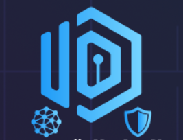
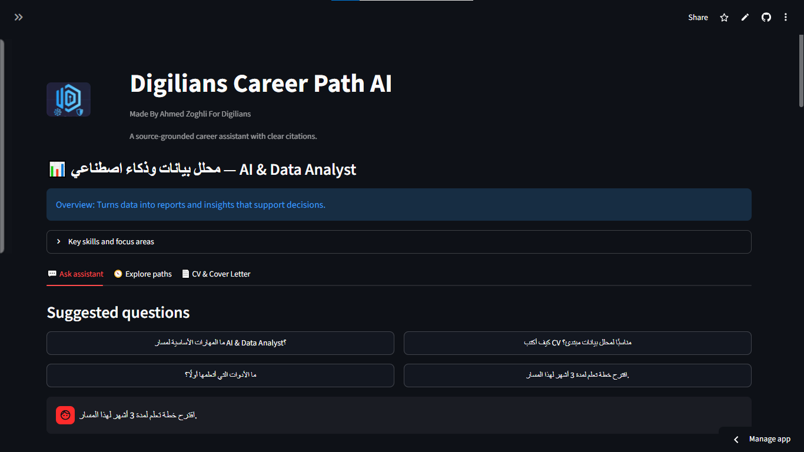

<div align="center">
  

# Digilians Career Path AI

### AI-Powered Career Guidance, CV Builder & RAG Assistant

**Made By Ahmed Zoghli For Digilians**

[](https://www.python.org/)
[](https://streamlit.io/)
[](https://www.trychroma.com/)
[](https://openrouter.ai/)

A bilingual **Arabic / English** career platform that uses Retrieval-Augmented Generation (RAG) to deliver source-grounded career guidance and generate truthful, ATS-friendly CVs aligned with a selected career path.

</div>

---

## ✨ Platform Preview



## 🎯 What problem does it solve?

Job seekers often need direction on skills, role requirements, CV structure, and cover letters. **Digilians Career Path AI** provides a single workspace to explore career paths, ask grounded questions, and build a professional CV from real user-provided information.

> The assistant is designed to use retrieved context for factual career guidance and show the sources used in every answer.

## 🚀 Features

### Career RAG Assistant
- **Eight focused career paths:** Software Developer, AI & Data Analyst, AI & Data Scientist, Cybersecurity Specialist, Digital Marketing Specialist, UX/UI Designer, Business Analyst, and Cloud Engineer.
- Career-path selector that focuses retrieval on the chosen role.
- Dynamic role overview, key skills, and suggested questions.
- Bilingual UI: Arabic and English.
- Source-grounded answers with visible retrieved chunks and citations.
- **🧹 Clear output** button to clear chat answers and generated CV output for the current session.

### CV Builder Pro
- Dedicated sections for Personal details, Experience, Education, Skills, Projects, Links, and Theme.
- Add multiple experiences, qualifications, projects, and links.
- Generate or regenerate an ATS-friendly CV tailored to the selected career path.
- Uses the candidate's provided information only; it is instructed not to invent experience, employers, dates, qualifications, metrics, or certificates.
- Live CV preview.
- Export the generated CV as **PDF**, **DOCX**, or **JSON**.

## 🧠 RAG Workflow

```text
Documents
  → Preprocessing
  → Chunking
  → Sentence Transformer Embeddings
  → ChromaDB Vector Store
  → Role-Focused Context Retrieval
  → Grounded OpenRouter Prompt
  → Streamlit Interface
```

## 🗂️ Project Structure

```text
CareerPath_AI_RAG/
├── 01_documents.py                 # Loads local corpus files
├── 02_preprocessing.py             # Cleans raw text
├── 03_chunking.py                  # Creates overlapping chunks
├── 04_vector_representation.py     # Sentence Transformer embeddings
├── 05_create_chroma_store.py       # Builds/version ChromaDB store
├── 06_retrieve_context.py          # Retrieves role-specific context
├── 07_prompting.py                 # Grounded OpenRouter generation
├── 08_resume_builder.py            # CV generation and PDF/DOCX export
├── streamlit_app.py                # Main application
├── documents/                      # Career and CV knowledge corpus
├── assets/                         # Digilians logo and UI screenshots
├── requirements.txt
├── PROJECT_DOCUMENTATION.md
└── PROJECT_PROGRESS.md
```

## 🛠️ Tech Stack

| Area | Technology |
|---|---|
| UI | Streamlit |
| Vector store | ChromaDB |
| Embeddings | `sentence-transformers/all-MiniLM-L6-v2` |
| LLM generation | OpenRouter |
| PDF export | ReportLab |
| DOCX export | python-docx |
| Career corpus | O*NET profiles, Harvard resume guidance, CareerOneStop guidance |

## ⚙️ Run Locally

### 1. Clone the repository

```bash
git clone https://github.com/ahmedzogly/CareerPath-AI-RAG.git
cd CareerPath-AI-RAG
```

### 2. Install dependencies

```bash
pip install -r requirements.txt
```

### 3. Configure your OpenRouter key

**macOS/Linux**

```bash
export OPENROUTER_API_KEY="your_openrouter_key"
export OPENROUTER_MODEL="openai/gpt-4o-mini" # optional
```

**Windows PowerShell**

```powershell
$env:OPENROUTER_API_KEY="your_openrouter_key"
$env:OPENROUTER_MODEL="openai/gpt-4o-mini"
```

### 4. Start the application

```bash
streamlit run streamlit_app.py
```

The first launch creates the local `chroma_db/` vector store from the files in `documents/`.

## ☁️ Deploy on Streamlit Cloud

1. Create an app from this GitHub repository.
2. Set `streamlit_app.py` as the main file.
3. Open **Manage app → Secrets**.
4. Add the following valid TOML:

```toml
OPENROUTER_API_KEY = "your_openrouter_key_here"
OPENROUTER_MODEL = "openai/gpt-4o-mini"
```

## 🔒 Security & Responsible Use

- **Never** commit a real API key, `.env`, or `.streamlit/secrets.toml`.
- Do not enter sensitive personal information into the CV builder.
- Review every AI-generated CV before sending it to an employer.
- O*NET profile content is mainly U.S.-oriented; it should not be treated as Egypt-specific legal, salary, licensing, or labor-market advice.
- The platform provides guidance and does not guarantee employment.

## 📚 Documentation

- [Project Documentation](PROJECT_DOCUMENTATION.md)
- [Project Progress](PROJECT_PROGRESS.md)

---

<div align="center">Built for Digilians with Python, Streamlit, ChromaDB, and OpenRouter.</div>
